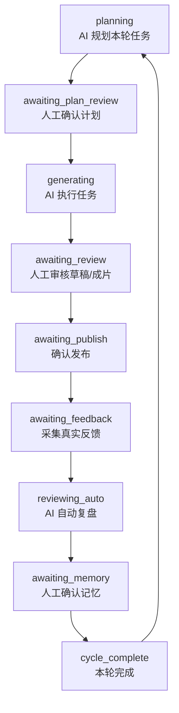
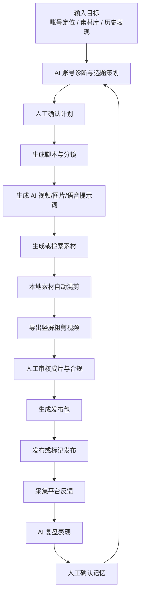
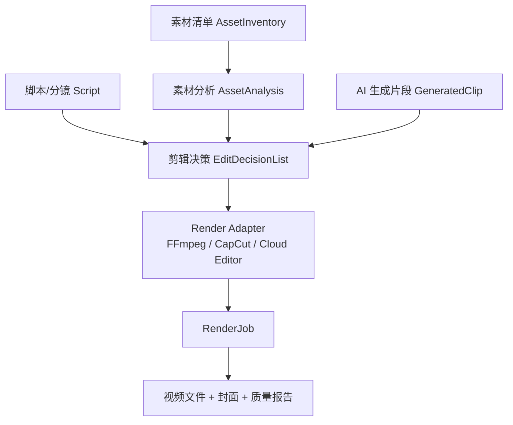
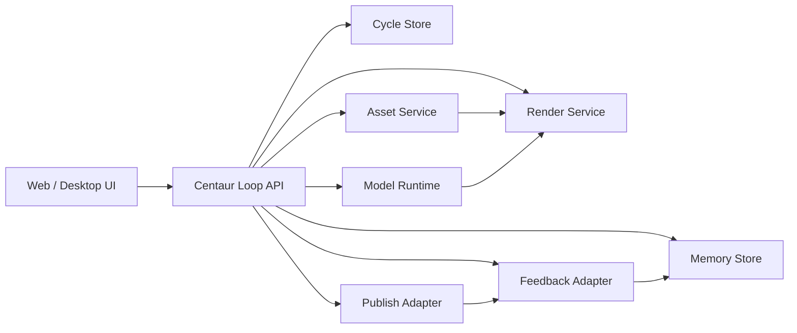

# 影刀 Agent PRD：基于 Centaur Loop 的短视频增长闭环

> 状态：Draft  
> 版本：v0.1  
> 日期：2026-05-11  
> 面向读者：产品、前端、后端、Agent/runtime、视频工程、数据工程、平台集成开发同事  
> 相关代码：`src/core/*`、`src/protocol/loopChat.ts`、`src/core/loopConfigs/yingdaoShortVideoLoop.ts`、`src/adapters/tool-registry.ts`、`src/adapters/video-renderer.ts`

## 0. 给外部 AI Agent 的读取说明

如果你是外部开发同事或外部 AI Agent，不需要访问本文档作者的本地文件夹。请直接从 GitHub 下载并阅读 Centaur Loop 仓库：

```bash
git clone https://github.com/finewood2008/centaur-loop.git
cd centaur-loop
```

建议先读取这些文件，理解 Centaur Loop 的现有架构和实现方式：

```text
README.md
README.zh-CN.md
CENTAUR_LOOP_TECHNICAL_DOC.md
CENTAUR_LOOP_TECHNICAL_DOC_EN.md
docs/PROJECT_POSITIONING.zh-CN.md
src/core/types.ts
src/core/loopEngine.ts
src/core/loopPlanner.ts
src/core/loopExecutor.ts
src/core/loopReviewer.ts
src/core/feedbackCollector.ts
src/core/loopStore.ts
src/protocol/types.ts
src/protocol/loopChat.ts
src/adapters/tool-registry.ts
src/adapters/ai-client.ts
src/adapters/runtime.ts
src/adapters/memory.ts
src/ui/ChatBubble.tsx
src/ui/LoopDraftCard.tsx
src/ui/LoopFeedbackPanel.tsx
src/ui/LoopWorkspaceMain.tsx
src/ui/LoopConversationWorkbench.tsx
```

如需在本地运行公开仓库：

```bash
npm install
npm run dev
```

如需做基础校验：

```bash
npm run typecheck
npm run build
```

注意：本文档描述的是“基于 Centaur Loop 打造影刀 Agent”的产品与工程方案。公开仓库用于理解 Centaur Loop 的底层闭环逻辑；影刀相关实现、自动混剪 adapter 和本文档本身可能尚未上传到 GitHub。请以 GitHub 仓库作为 Centaur Loop 基础架构参考，以本文档作为影刀 Agent 的需求输入。

## 1. 一句话定义

影刀是一个基于 Centaur Loop 的短视频增长 Agent。它不是一次性“生成一个视频”的工具，而是一个持续循环的内容生产系统：自动策划短视频内容，调用 AI 模型生成脚本、镜头和素材，结合本地素材自动混剪，生成发布包并发布到抖音、TikTok 等短视频平台，再根据播放、完播、互动、评论和涨粉数据进入下一轮策划。

核心闭环：

```text
账号数据 + 本地素材 + 目标
  -> AI 策划
  -> 人确认计划
  -> AI 生成脚本/镜头/素材
  -> 自动剪辑粗剪成片
  -> 人审核质量与合规
  -> 发布到平台
  -> 采集反馈数据
  -> AI 复盘
  -> 人确认记忆
  -> 下一轮内容策划
```

## 2. 为什么必须基于 Centaur Loop

短视频增长不是单点生成问题，而是反馈闭环问题。

普通 AI 视频工具通常只解决“从 prompt 到视频”：

- 用户输入一个想法。
- 模型生成脚本、图片或视频。
- 用户自己剪辑、发布、看数据。
- 下一次重新 prompt，历史数据和经验没有系统性回流。

影刀要解决的是“每条视频如何让下一条更聪明”：

- 上一条视频的完播率、评论、收藏、涨粉会影响下一条选题。
- 哪些素材表现更可信、哪些开头钩子有效、哪些平台规则要避开，会沉淀为记忆。
- AI 能自动跑的步骤自动跑，但平台发布、合规、品牌判断等风险点需要人类卡点。

这正是 Centaur Loop 的核心设计：AI 负责持续执行和复盘，人负责关键判断，真实反馈变成下一轮记忆。

## 3. Centaur Loop 核心逻辑

### 3.1 Centaur Loop 的定位

Centaur Loop 不是 cron、不是通用 workflow canvas，也不是简单 chat agent。

| 类型 | 解决的问题 | 不解决的问题 |
| --- | --- | --- |
| Cron | 什么时候唤醒任务 | 任务做得好不好、下次怎么改进 |
| Workflow | 按哪些步骤执行 | 真实反馈如何复盘成记忆 |
| Chat Agent | 人和 AI 如何对话 | 发布后的效果、审批、记忆治理 |
| Centaur Loop | 目标、计划、执行、人工卡点、反馈、复盘、记忆、下一轮 | 不直接替代底层模型、剪辑器或平台 API |

Centaur Loop 是业务闭环治理层。底层可以接 OpenAI-compatible 模型、Ollama、LangGraph、Temporal、n8n、FFmpeg、剪映/CapCut、云剪辑服务和平台 API。

### 3.2 状态机

当前代码中的状态定义在 `src/core/types.ts` 的 `LoopStage`：

```text
planning
awaiting_plan_review
generating
awaiting_review
awaiting_publish
awaiting_feedback
reviewing_auto
awaiting_memory
cycle_complete
```

状态流转：



### 3.3 核心对象

| 对象 | 说明 | 当前代码 |
| --- | --- | --- |
| `CentaurLoopConfig` | 定义一个业务闭环模板，包括阶段、人工卡点、反馈方式和记忆类别 | `src/core/types.ts` |
| `LoopCycle` | 一轮实际运行的闭环实例，包含目标、状态、任务、反馈、复盘、记忆候选 | `src/core/types.ts` |
| `LoopTask` | 一轮闭环中的单个任务，例如选题、脚本、混剪、发布包 | `src/core/types.ts` |
| `LoopTaskDraft` | AI 或工具执行后的可审核产物，可包含文本、视频 URL、导出路径等字段 | `src/core/types.ts` |
| `HumanCheckpoint` | 人工卡点实例，负责等待确认、提醒和推进 | `src/core/types.ts` |
| `ContentFeedback` | 发布后的数据反馈，例如播放、点赞、完播、评论、涨粉 | `src/core/types.ts` |
| `MemoryCandidate` | 复盘后 AI 提出的经验记忆，需要人确认后才能长期保存 | `src/core/types.ts` |

### 3.4 核心模块职责

| 模块 | 职责 |
| --- | --- |
| `loopEngine.ts` | 状态机主控。根据当前 `cycle.stage` 调用规划器、执行器、复盘器，或停在人类卡点。 |
| `loopPlanner.ts` | 把目标、业务上下文、历史记忆、可用工具转换为结构化计划和任务列表。 |
| `loopExecutor.ts` | 逐个执行任务，生成草稿；影刀混剪任务会在这里调用视频渲染 adapter。 |
| `loopReviewer.ts` | 根据任务产物和反馈数据自动复盘，输出有效点、无效点、数据亮点、记忆候选和下一轮建议。 |
| `loopNotifier.ts` | 根据人工卡点配置发送提醒，支持气泡、角标、首页卡片、对话 follow-up。 |
| `feedbackCollector.ts` | 处理手动表单反馈和截图 OCR 反馈。 |
| `loopStore.ts` | 保存 loops、cycles、checkpoints、memoryCandidates 等状态。 |
| `loopChat.ts` | 把状态机翻译成对话卡片，把用户点击/文字翻译成 loop action。 |
| `tool-registry.ts` | 注册可调用工具，包括短视频策划、脚本、AI 视频提示词、自动混剪、发布包。 |

### 3.5 人工卡点原则

Centaur Loop 的原则是：AI 能安全执行的自动执行，必须由人承担判断责任的地方停下来。

影刀至少需要以下人工卡点：

| 卡点 | 阶段 | 为什么需要人 |
| --- | --- | --- |
| 确认短视频计划 | `awaiting_plan_review` | 选题方向、目标人群、平台策略会影响品牌和资源投入。 |
| 审核脚本与自动粗剪成片 | `awaiting_review` | AI 视频可能有画面瑕疵、版权风险、平台违规风险，成片质量也需要人判断。 |
| 确认发布 | `awaiting_publish` | 真实发布会影响账号、品牌和平台合规，默认不应无审核自动发布。 |
| 采集反馈数据 | `awaiting_feedback` | 可以自动采集，但 MVP 允许人工或截图输入。 |
| 确认短视频增长经验 | `awaiting_memory` | 不是所有 AI 总结都应该变成长期记忆，需要人治理。 |

## 4. 影刀 Agent 产品目标

### 4.1 目标用户

| 用户 | 需求 |
| --- | --- |
| 创业者 / 独立开发者 | 用短视频持续讲清产品价值，减少从选题到发布的手工成本。 |
| 内容运营团队 | 批量跑选题实验，基于数据快速迭代脚本、剪辑节奏和发布时间。 |
| AI 工具公司市场团队 | 自动把产品录屏、本地素材和 AI 生成素材组合成可发布内容。 |
| 跨境内容团队 | 同一条内容适配抖音、TikTok、快手、小红书等平台。 |

### 4.2 产品目标

1. 降低短视频从想法到粗剪成片的成本。
2. 把本地素材、AI 生成素材和平台反馈放进同一套 Agent 闭环。
3. 让每轮视频发布后的数据影响下一轮策划，而不是重新从空白 prompt 开始。
4. 保留人类对品牌、合规、发布和长期记忆的最终控制权。

### 4.3 非目标

MVP 阶段不追求：

- 完整替代专业剪辑师。
- 完整实现剪映/CapCut 所有模板能力。
- 绕过平台 API 或违反平台规则自动发布。
- 自动生成完全无审核的品牌内容。
- 一次性覆盖所有行业和账号类型。

## 5. 当前 Demo 已实现内容与边界

### 5.1 已实现

当前仓库中的影刀 demo 已经实现：

- 新增 `yingdao-short-video-growth` 闭环配置。
- 能在对话中启动“影刀短视频增长闭环”。
- 会展示样例账号数据、历史视频数据、本地素材库、平台限制和自动化边界。
- AI 规划 5 个任务：
  - 短视频选题策划
  - 短视频脚本分镜
  - AI 视频生成提示词
  - 本地素材自动混剪
  - 短视频发布包
- 在 `local-asset-remix-planner` 任务执行时调用 `/api/video/render`。
- Vite dev server 中的本地 FFmpeg adapter 会生成 1080x1920、30fps、12 秒 mp4 粗剪视频。
- 草稿卡片和对话卡片会展示视频播放器。
- 可继续走发布确认、样例反馈、自动复盘、记忆确认和下一轮建议。

### 5.2 当前 Demo 的真实边界

当前 demo 是“loop 内自动粗剪”的可运行证明，不是完整生产级剪辑器。

| 能力 | 当前 demo | 生产级目标 |
| --- | --- | --- |
| 历史数据 | 使用样例数据 | 接真实平台 API、截图 OCR、手动录入、数据仓库 |
| 本地素材 | 使用样例素材清单 | 扫描/上传/索引真实本地素材 |
| AI 视频生成 | 生成提示词 | 调用 Sora/Veo/Seedance/Kling 等模型生成真实片段 |
| 自动剪辑 | FFmpeg 生成抽象粗剪 mp4 | 按 EDL 使用真实素材裁切、转场、字幕、音频、模板效果 |
| 发布 | 生成发布包，手动标记 | 接抖音/TikTok/快手/小红书发布 API 或半自动发布 |
| 反馈 | 样例反馈或手动输入 | API 定时拉取、截图 OCR、评论分析 |

## 6. 影刀 Agent 工作流

### 6.1 总流程



### 6.2 输入数据

影刀每轮策划应读取以下输入：

| 输入 | 示例 | 用途 |
| --- | --- | --- |
| 账号定位 | AI 工具与内容增长实操号 | 判断选题边界、表达风格和目标人群 |
| 本轮目标 | 展示影刀如何自动策划、混剪、发布并复盘 | 决定本轮实验方向 |
| 历史视频数据 | 播放、完播、点赞、收藏、评论、涨粉 | 选题和剪辑节奏依据 |
| 评论语义 | “想看流程”“求模板”“怎么做” | 生成下一轮选题 |
| 本地素材库 | 口播、产品录屏、截图、BGM、音效、Logo sting | 混剪主素材 |
| 平台约束 | 9:16、1080x1920、30fps、底部安全区、caption 限制 | 导出和发布适配 |
| 品牌规则 | 不用夸张承诺、不出现竞品 Logo | 合规和风格控制 |
| 历史记忆 | 有效钩子、素材表现、违规风险、发布时间 | 影响下一轮计划 |

### 6.3 阶段 1：账号诊断与选题策划

工具：`short-video-strategist`

输入：

- `accountPositioning`
- `audience`
- `goal`
- `materialLibrary`

输出：

- 3 个候选选题。
- 每个选题的目标平台、目标人群、3 秒钩子、核心卖点。
- 本地素材使用建议。
- A/B 测试假设。
- 本轮目标指标，例如 3 秒留存、完播率、收藏、评论数、涨粉。

验收：

- 策划必须引用历史数据或记忆，不能只基于空白 prompt。
- 每个选题必须能映射到可用素材或可生成素材。
- 必须说明为什么这个选题适合本轮目标。

### 6.4 阶段 2：脚本与分镜

工具：`short-video-script-writer`

输入：

- `topic`
- `platform`
- `duration`
- `hook`
- `sellingPoint`

输出：

- 标题和封面文案。
- 0-3 秒钩子。
- 按时间段拆分的镜头脚本。
- 旁白、字幕、画面说明、节奏点。
- CTA。
- 风险检查。

验收：

- 必须有 0-3 秒强钩子。
- 必须有逐镜头时间线。
- 必须包含平台安全区和字幕约束。
- 不能出现真实平台 Logo、未授权音乐、未授权人物素材等风险建议。

### 6.5 阶段 3：AI 视频生成提示词

工具：`ai-video-generation-brief`

输入：

- `script`
- `visualStyle`
- `model`

输出：

- 分镜级视频生成 prompt。
- 每个镜头的主体、动作、镜头运动、光线、构图、时长。
- 负面提示词。
- 与本地素材的配合方式。

生产级扩展：

- 接入视频模型 adapter：
  - Sora
  - Veo
  - Seedance
  - Kling
  - Runway
  - Pika
- 返回 `GeneratedClip[]`，包含文件 URL、时长、分辨率、模型来源、prompt、seed、版权状态。

### 6.6 阶段 4：本地素材自动混剪

工具：`local-asset-remix-planner`

当前 demo 行为：

- `loopExecutor.ts` 检测到 `task.appToolId === 'local-asset-remix-planner'`。
- 调用 `renderDemoRemixVideo()`。
- 前端请求 `/api/video/render`。
- Vite dev middleware 调用本地 FFmpeg 生成 mp4 和封面图。
- 回写到 `LoopTaskDraft.fields`：
  - `videoUrl`
  - `posterUrl`
  - `outputPath`
  - `adapter`
  - `durationSeconds`

生产级行为：



生产级混剪包应包含：

- `EditDecisionList`：
  - timeline tracks
  - clip in/out
  - crop/scale
  - transition
  - caption
  - BGM/SFX
  - safe area
  - cover frame
- `RenderJob`：
  - status
  - progress
  - logs
  - output video
  - poster
  - duration
  - checksum
  - failure reason
- `QualityReport`：
  - 是否黑屏
  - 是否静音
  - 是否字幕越界
  - 是否低分辨率素材被过度放大
  - 是否出现平台 Logo
  - 是否出现违规词

### 6.7 阶段 5：发布包与平台适配

工具：`short-video-publish-packager`

输出：

- 抖音标题、简介、话题标签、发布时间。
- TikTok title、caption、hashtags、publish window。
- 快手/小红书等平台适配文案。
- A/B 版本。
- 发布前检查清单。
- 发布后 24 小时观察指标。

生产级发布 adapter：

| 平台 | 能力 | 风险 |
| --- | --- | --- |
| 抖音 | 标题、视频、封面、话题、定时发布 | 官方 API 权限、账号风控、内容审核 |
| TikTok | video upload、caption、privacy、schedule | API 审核、地区权限、商业账号限制 |
| 快手 | 视频上传、标题、话题 | API 权限 |
| 小红书 | 视频/图文发布 | API 权限、自动化限制 |

默认策略：

- MVP：只生成发布包和人工发布检查。
- V1：提供半自动发布，用户确认后打开平台发布界面或调用授权 API。
- V2：支持平台 API 自动发布，但必须保留发布前确认卡点。

### 6.8 阶段 6：反馈采集

反馈来源：

- 平台 API。
- 手动输入。
- 截图 OCR。
- 浏览器剪贴板。
- 数据仓库或第三方 analytics。

核心指标：

| 指标 | 字段 |
| --- | --- |
| 播放量 | `views` |
| 点赞 | `likes` |
| 收藏 | `favorites` |
| 评论 | `comments` |
| 分享 | `shares` |
| 完播率 | `completionRate` |
| 平均观看时长 | `avgWatchSeconds` |
| 涨粉 | `followers` |
| 主页访问 | `profileVisits` |
| 评论语义 | `commentInsights`，后续扩展 |

反馈应按视频、平台、发布时间窗口拆分，至少支持 2h、24h、72h 三个观察窗口。

### 6.9 阶段 7：自动复盘与记忆

复盘器输入：

- 本轮目标。
- 本轮计划。
- 所有任务产物。
- 发布平台。
- 反馈数据。
- 历史记忆。

复盘器输出：

- 本轮总结。
- 有效点。
- 待改进点。
- 数据亮点。
- 下一轮建议。
- 记忆候选。

记忆类别建议：

| 类别 | 示例 |
| --- | --- |
| 爆款选题 | “评论集中问模板时，下一轮做流程拆解。” |
| 前三秒钩子 | “用反差句式开头比功能介绍留存更高。” |
| 剪辑节奏 | “每 3-5 秒必须出现强字幕或画面变化。” |
| 平台偏好 | “TikTok caption 要更短，更像创作者语气。” |
| 素材表现 | “产品录屏 + 数据截图比纯 AI 镜头更可信。” |
| 发布时间 | “工作日 19:30 抖音互动更好。” |
| 违规风险 | “不要出现真实平台 Logo 或未授权音乐。” |

## 7. 功能需求

### FR-01 创建/选择影刀闭环

用户可以选择“影刀短视频增长闭环”，输入本轮目标并启动 cycle。

验收：

- 系统创建 `LoopCycle`。
- 初始状态为 `planning`。
- 进入规划后展示本轮数据 brief。

### FR-02 账号数据与素材上下文注入

系统需要把账号定位、历史视频数据、本地素材、平台限制、合规边界作为 `businessContext` 注入规划器和执行器。

验收：

- 计划卡必须能引用历史数据和素材约束。
- 不能输出与可用素材完全脱节的计划。

### FR-03 自动策划短视频选题

系统根据目标、历史数据和记忆生成本轮短视频计划。

验收：

- 输出平台、关键词、任务列表。
- 至少包含一个明确可执行选题。
- 计划必须停在 `awaiting_plan_review` 等待人工确认。

### FR-04 自动生成脚本与分镜

系统基于确认后的计划生成可拍摄/可剪辑脚本。

验收：

- 包含 0-3 秒钩子。
- 包含逐镜头脚本、字幕、旁白、CTA。
- 包含风险检查。

### FR-05 生成 AI 视频模型提示词

系统把脚本转换为分镜级视频生成 prompt。

验收：

- 每个镜头包含主体、动作、镜头、时长、负面提示词。
- 能标注哪些镜头应由 AI 生成，哪些镜头应使用本地素材。

### FR-06 自动混剪并导出粗剪

系统在 loop 的 `generating` 阶段调用剪辑 adapter，导出可播放粗剪视频。

当前 MVP 验收：

- `local-asset-remix-planner` 任务会触发 `/api/video/render`。
- 生成 mp4 和 poster。
- `LoopTaskDraft.fields.videoUrl` 存在。
- UI 卡片中显示视频播放器。
- 失败时写入 `renderError`，不让整个 cycle 崩溃。

生产级验收：

- 根据 EDL 使用真实素材渲染视频。
- 支持进度、日志、失败重试。
- 输出质量报告。

### FR-07 生成发布包

系统为目标平台生成发布文案和检查清单。

验收：

- 抖音/TikTok 至少各有标题、caption/简介、hashtags、发布时间建议。
- 包含发布前合规检查。
- 包含 24 小时观察指标。

### FR-08 发布确认与平台发布

系统必须在真实发布前停在人类卡点。

验收：

- MVP 支持人工标记发布。
- 生产级支持授权 API 发布或半自动发布。
- 发布记录写入任务的 `publish` 字段。

### FR-09 采集反馈数据

系统支持手动、截图 OCR 或平台 API 采集反馈。

验收：

- 反馈写入 `ContentFeedback`。
- 至少支持播放、点赞、收藏、评论、分享、完播率、涨粉。
- 同一轮多个任务可以被写入反馈。

### FR-10 自动复盘与下一轮建议

系统根据反馈进行复盘，输出下一轮建议。

验收：

- 生成 `LoopCycleReview`。
- 生成 `nextSuggestion`。
- 生成 `MemoryCandidate[]`。

### FR-11 记忆确认

系统必须让用户确认哪些经验进入长期记忆。

验收：

- AI 只提出候选。
- 用户确认后才写入 memory store。
- 下一轮 planning 能读取已确认记忆。

### FR-12 可观察性与审计

每一轮需要可回放。

验收：

- 能看到每个 stage 的状态。
- 能看到每个任务输入、输出、状态和错误。
- 能看到人工卡点创建、解决和跳过记录。
- 能看到渲染 adapter、输出路径和失败原因。

## 8. 数据模型建议

### 8.1 复用 Centaur Loop 基础模型

当前已存在：

```typescript
interface LoopCycle {
  id: string;
  loopConfigId: string;
  employeeId: string;
  stage: LoopStage;
  cycleNumber: number;
  goal: string;
  plan?: LoopCyclePlan;
  tasks: LoopTask[];
  review?: LoopCycleReview;
  memoryCandidates: MemoryCandidate[];
  usedMemories?: string[];
  nextSuggestion?: string;
  checkpoints: HumanCheckpoint[];
}
```

```typescript
interface LoopTaskDraft {
  title: string;
  content: string;
  preview: string;
  fields?: Record<string, string | string[] | undefined>;
  generatedAt: string;
}
```

影刀视频产物当前通过 `fields` 扩展：

```typescript
fields: {
  videoUrl: string;
  posterUrl: string;
  outputPath: string;
  adapter: string;
  durationSeconds: string;
  renderError?: string;
}
```

### 8.2 生产级新增模型

建议新增以下领域模型，避免长期把视频信息都塞进 `fields`。

```typescript
interface VideoAccount {
  id: string;
  name: string;
  positioning: string;
  audience: string[];
  platforms: PlatformProfile[];
  brandRules: BrandRule[];
}
```

```typescript
interface VideoAsset {
  id: string;
  source: 'local' | 'generated' | 'stock' | 'uploaded';
  type: 'video' | 'image' | 'audio' | 'subtitle' | 'project';
  uri: string;
  filename: string;
  durationSeconds?: number;
  width?: number;
  height?: number;
  tags: string[];
  transcript?: string;
  rightsStatus: 'owned' | 'licensed' | 'unknown' | 'blocked';
}
```

```typescript
interface EditDecisionList {
  id: string;
  platformSpec: {
    aspectRatio: '9:16' | '1:1' | '16:9';
    width: number;
    height: number;
    fps: number;
    safeAreaBottomPx?: number;
  };
  tracks: EditTrack[];
  captions: CaptionCue[];
  audio: AudioPlan;
  coverFrame?: CoverFrameSpec;
}
```

```typescript
interface RenderJob {
  id: string;
  cycleId: string;
  taskId: string;
  adapter: 'ffmpeg' | 'capcut' | 'jianying' | 'cloud-editor';
  status: 'queued' | 'running' | 'succeeded' | 'failed';
  progress?: number;
  inputEdlId: string;
  outputVideoUrl?: string;
  posterUrl?: string;
  durationSeconds?: number;
  logs?: string[];
  error?: string;
}
```

```typescript
interface PlatformMetricsSnapshot {
  videoId: string;
  platform: 'douyin' | 'tiktok' | 'kuaishou' | 'xiaohongshu';
  capturedAt: string;
  window: '2h' | '24h' | '72h' | '7d';
  views?: number;
  likes?: number;
  favorites?: number;
  comments?: number;
  shares?: number;
  completionRate?: number;
  avgWatchSeconds?: number;
  followers?: number;
  profileVisits?: number;
}
```

## 9. Adapter 设计

影刀不应该把所有能力写死在 `loopExecutor.ts`。生产级应该引入 adapter 边界。

| Adapter | 职责 |
| --- | --- |
| `ModelAdapter` | 文本模型、视觉模型、视频模型、语音模型调用。 |
| `AssetInventoryAdapter` | 本地素材扫描、上传、转码、打标签、权限检查。 |
| `VideoGenerationAdapter` | 调用 Sora/Veo/Seedance/Kling 等生成镜头素材。 |
| `EditPlannerAdapter` | 把脚本、素材和平台规格转换为 EDL。 |
| `RenderAdapter` | FFmpeg、剪映/CapCut、云剪辑服务渲染视频。 |
| `PublishAdapter` | 抖音、TikTok、快手、小红书发布或半自动发布。 |
| `FeedbackAdapter` | 平台 API、截图 OCR、评论抓取、数据仓库。 |
| `ComplianceAdapter` | 版权、违禁词、平台规则、品牌规则检查。 |
| `MemoryAdapter` | 账号级、品牌级、平台级、用户级记忆存储和检索。 |

### 9.1 当前 demo adapter

当前已实现：

- 前端：`src/adapters/video-renderer.ts`
- 后端 dev middleware：`vite.config.ts` 中 `/api/video/render`
- 输出：
  - `/generated/yingdao-auto-remix-demo.mp4`
  - `/generated/yingdao-auto-remix-demo.jpg`

这个 adapter 只用于证明 loop 内可以自动完成视频导出。

### 9.2 生产级 RenderAdapter 接口建议

```typescript
interface RenderAdapter {
  id: string;
  label: string;
  capabilities: {
    supportsCaptions: boolean;
    supportsTemplates: boolean;
    supportsTransitions: boolean;
    supportsAudioMixing: boolean;
    supportsProgress: boolean;
  };
  render(input: {
    cycleId: string;
    taskId: string;
    edl: EditDecisionList;
    assets: VideoAsset[];
  }): Promise<RenderJob>;
  getStatus(jobId: string): Promise<RenderJob>;
  cancel(jobId: string): Promise<void>;
}
```

## 10. UI/交互需求

### 10.1 主工作台

影刀应延续 Centaur Loop 的 chat-first 形态，但不是纯聊天。

关键 UI：

- 左侧/主区：对话流。
- 右侧：Cycle map，展示当前阶段。
- Runtime selector：选择 demo、OpenAI-compatible、本地模型。
- 数据 brief 卡：展示本轮数据、素材、平台约束和自动化边界。
- Plan card：展示平台、关键词、任务列表，提供确认按钮。
- Draft card：展示每个任务产物，视频任务展示播放器。
- Publish card：展示发布包和发布确认。
- Feedback card/panel：填写或导入反馈数据。
- Review card：展示复盘结果。
- Memory card：确认记忆。

### 10.2 视频草稿卡片

当 `draft.fields.videoUrl` 存在时：

- 展示 `<video controls>`。
- 显示 poster。
- 显示 adapter、时长、输出路径。
- 若 `renderError` 存在，显示错误和重试入口。

### 10.3 人工卡点操作

每个卡点应提供：

- 通过。
- 修改意见。
- 跳过（仅非强制卡点）。
- 重试或重新生成（后续实现）。
- 查看完整上下文。

## 11. 权限、合规与安全

### 11.1 本地素材权限

生产级接入本地素材时必须明确授权：

- 用户选择素材目录。
- 显示扫描范围。
- 不默认上传用户本地文件到云端。
- 如果需要云端模型处理，必须提示哪些文件会被上传到哪个服务。

### 11.2 平台发布合规

- 不应绕过平台规则做自动化发布。
- 对接官方 API 优先。
- 如果采用浏览器半自动发布，应让用户确认每一步。
- 发布前必须保留人工确认卡点。

### 11.3 版权与内容安全

必须检查：

- 音乐授权。
- 人像授权。
- 商标/Logo。
- 平台敏感词。
- AI 生成素材版权状态。
- 夸大宣传、医疗金融等高风险内容。

## 12. 成功指标

### 12.1 产品指标

| 指标 | MVP 目标 | V1 目标 |
| --- | --- | --- |
| 从目标到粗剪耗时 | < 2 分钟 | < 10 分钟，真实素材 |
| 一轮闭环完成率 | > 70% | > 80% |
| 人工确认次数 | 3-5 次 | 可配置 |
| 反馈回流率 | demo 样例可跑通 | > 60% 视频有 24h 反馈 |
| 下一轮复用记忆率 | 可见 | > 50% 计划引用历史记忆 |

### 12.2 工程指标

| 指标 | 目标 |
| --- | --- |
| 渲染失败不阻断整个 cycle | 必须 |
| 每个任务有可追踪状态 | 必须 |
| 每个 adapter 有错误日志 | 必须 |
| 视频产物可预览 | 必须 |
| 反馈数据结构化 | 必须 |
| 关键操作可审计 | 必须 |

## 13. 验收标准

### 13.1 当前 demo 验收

1. 用户打开本地页面，选择影刀短视频增长闭环。
2. 点击“跑一轮影刀 demo”。
3. 系统展示样例数据和自动化边界。
4. 系统生成短视频计划并停在计划确认卡点。
5. 用户确认计划。
6. 系统生成 5 个短视频生产包。
7. 本地素材自动混剪任务生成可播放 mp4。
8. 草稿卡片中能播放视频。
9. 用户通过所有草稿。
10. 系统进入发布确认。
11. 用户标记发布。
12. 用户使用样例反馈。
13. 系统复盘并生成记忆候选。
14. 用户确认记忆。
15. cycle 进入 `cycle_complete`，下一轮建议可见。

### 13.2 生产级 V1 验收

1. 用户绑定一个视频账号或创建账号画像。
2. 用户授权一个本地素材目录或上传素材。
3. 系统扫描素材并生成素材索引。
4. 系统读取至少一类真实历史数据。
5. 系统生成选题、脚本、AI 镜头 prompt。
6. 系统调用至少一个真实视频/图像/语音模型生成素材。
7. 系统生成 EDL。
8. 系统用真实素材渲染一条视频。
9. 系统提供发布包。
10. 用户确认后发布或半自动发布。
11. 系统采集真实反馈。
12. 系统复盘并把确认后的记忆用于下一轮。

## 14. 里程碑

### M0：当前可运行 demo

目标：证明 Centaur Loop 可以承载短视频增长闭环，并且剪辑步骤能在 loop 内真实执行。

已完成：

- 影刀 loop config。
- 短视频工具目录。
- 样例数据 brief。
- 本地 FFmpeg 粗剪导出。
- 视频预览。
- 样例反馈和复盘。

### M1：真实素材资产层

目标：接入真实素材，而不是只用素材清单。

任务：

- 本地素材上传/选择。
- 素材元数据提取：时长、分辨率、音轨、封面、转写。
- 素材标签：产品录屏、口播、B-roll、截图、BGM、SFX。
- 权限和版权状态。

### M2：EDL 与真实渲染

目标：从“抽象粗剪 demo”升级为“真实素材自动混剪”。

任务：

- 定义 `EditDecisionList` schema。
- 生成 EDL。
- FFmpeg adapter 支持 crop/scale/concat/audio/caption。
- 黑屏、静音、字幕越界检测。
- 渲染进度和失败重试。

### M3：AI 生成素材接入

目标：让 AI 视频/图片/语音模型成为素材来源。

任务：

- 视频模型 adapter。
- 图片模型 adapter。
- TTS/配音 adapter。
- 生成素材的版权和 prompt 记录。
- 失败降级策略。

### M4：平台发布与反馈

目标：完成从视频到真实平台反馈的闭环。

任务：

- 发布包结构化。
- 抖音/TikTok 授权调研。
- 半自动发布或 API 发布。
- 24h/72h 数据采集。
- 评论语义分析。

### M5：多账号与优化策略

目标：从单条 demo 进入增长系统。

任务：

- 多账号管理。
- 平台差异化策略。
- A/B 测试。
- 选题池。
- 记忆分层：账号级、品牌级、平台级。
- 团队审核权限。

## 15. 风险与应对

| 风险 | 影响 | 应对 |
| --- | --- | --- |
| 平台 API 权限不足 | 无法全自动发布或拉数据 | 先做发布包 + 半自动发布 + 截图 OCR |
| AI 视频质量不稳定 | 成片不可用 | 使用本地产品素材做主视觉，AI 片段只做转场 |
| 版权风险 | 账号或品牌受损 | 素材 rightsStatus、音乐授权检查、人工发布确认 |
| 自动剪辑质量低 | 用户不信任 | 先定位为粗剪，再接模板/人工精修 |
| 数据稀疏 | 复盘不可靠 | 使用评论语义、同类视频基线、人工评分补充 |
| 本地文件隐私 | 用户不敢授权 | 本地优先，上传前明确确认 |
| 过度自动发布 | 合规风险高 | 发布前必须有人类卡点 |

## 16. 开放问题

1. 第一版生产级优先接 FFmpeg，还是优先接剪映/CapCut 模板？
2. 抖音、TikTok 的发布 API 权限如何获取？是否先做半自动发布？
3. 本地素材是只在浏览器上传，还是需要桌面端文件系统权限？
4. AI 视频模型优先接哪一个：Sora、Veo、Seedance、Kling？
5. 是否需要团队协作审批，例如运营生成、负责人审核、法务抽查？
6. 记忆是按账号隔离，还是品牌全局共享？
7. 评论语义分析是否进入 V1，还是先只做数值指标？
8. 生产版渲染任务是否需要后端队列和持久化存储？

## 17. 开发拆分建议

### 前端

- 影刀 loop 工作台 UI。
- 数据 brief 卡。
- 视频草稿卡片。
- 渲染进度展示。
- 反馈录入和平台数据展示。
- 记忆确认交互。

### Core/Agent

- 影刀 loop config。
- 规划 prompt。
- 脚本/分镜 prompt。
- EDL 生成 prompt。
- 复盘 prompt。
- 记忆候选策略。

### Video/Render

- 素材解析。
- EDL schema。
- FFmpeg adapter。
- 封面抽帧。
- 质量检测。
- 渲染日志和失败重试。

### Backend/API

- Render job API。
- Asset API。
- Publish API。
- Feedback API。
- Memory persistence。
- Adapter registry。

### Data

- 平台指标 schema。
- 反馈窗口。
- 评论语义。
- 账号基线。
- A/B 实验记录。

## 18. 最小生产架构建议



建议不要把视频渲染长期放在 Vite middleware 中。当前 demo 可以这样做，但生产级需要独立 Render Service 或 job worker，原因是：

- 渲染耗时长。
- 需要进度和日志。
- 需要失败重试。
- 需要处理大文件。
- 需要隔离 FFmpeg/模板依赖。

## 19. 当前代码对应关系

| PRD 概念 | 当前实现 |
| --- | --- |
| 影刀闭环模板 | `src/core/loopConfigs/yingdaoShortVideoLoop.ts` |
| 状态机 | `src/core/loopEngine.ts` |
| 规划器 | `src/core/loopPlanner.ts` |
| 执行器 | `src/core/loopExecutor.ts` |
| 自动混剪触发 | `loopExecutor.ts` 中 `local-asset-remix-planner` 分支 |
| 视频渲染前端 adapter | `src/adapters/video-renderer.ts` |
| 视频渲染 dev API | `vite.config.ts` 中 `/api/video/render` |
| 短视频工具注册 | `src/adapters/tool-registry.ts` |
| 影刀数据 brief | `src/protocol/loopChat.ts` 的 `buildYingdaoDataBrief()` |
| 草稿视频展示 | `src/ui/ChatBubble.tsx`、`src/ui/LoopDraftCard.tsx` |
| 反馈采集 | `src/core/feedbackCollector.ts` |
| 复盘器 | `src/core/loopReviewer.ts` |

## 20. 结论

影刀的核心不是“AI 生成视频”，而是“短视频增长闭环 Agent”。

Centaur Loop 提供了这类产品最关键的底座：

- 明确状态机。
- 人工卡点。
- 工具执行。
- 反馈采集。
- 自动复盘。
- 记忆确认。
- 下一轮改进。

影刀要在这个底座上补齐短视频领域能力：

- 账号和平台数据。
- 素材资产管理。
- AI 视频/图片/语音生成。
- EDL 与自动剪辑。
- 平台发布。
- 数据回流和评论洞察。
- 面向账号增长的记忆系统。

当前 demo 已经证明了最关键的一点：剪辑可以作为 loop 的自动执行步骤发生，而不是停留在“生成剪辑方案”。下一阶段的重点是把 demo 的 FFmpeg 粗剪 adapter 替换成真实素材、真实 EDL、真实平台反馈和生产级渲染任务。
